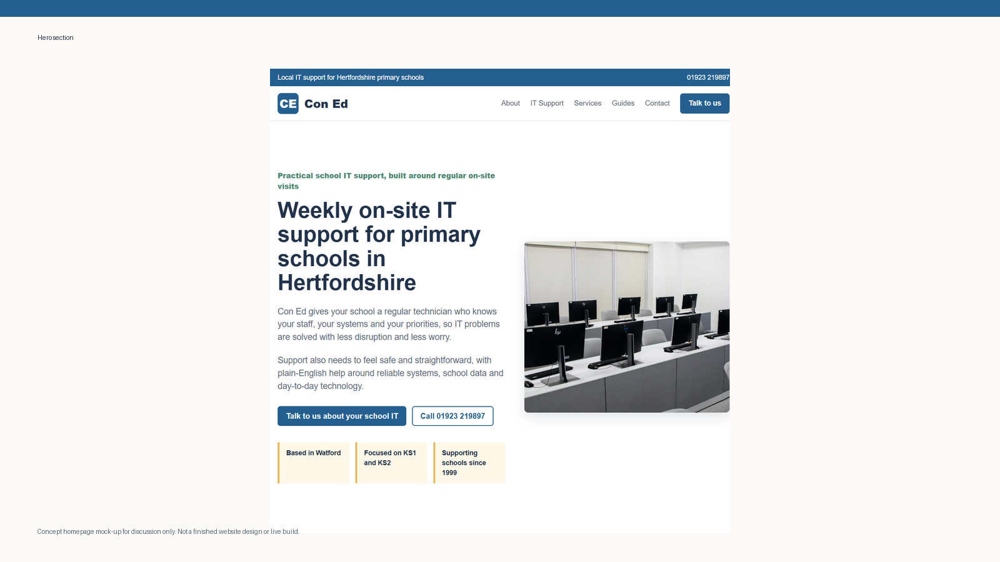
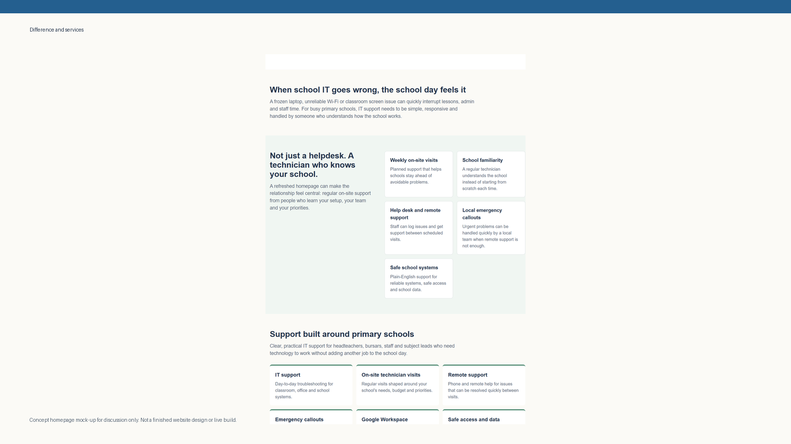
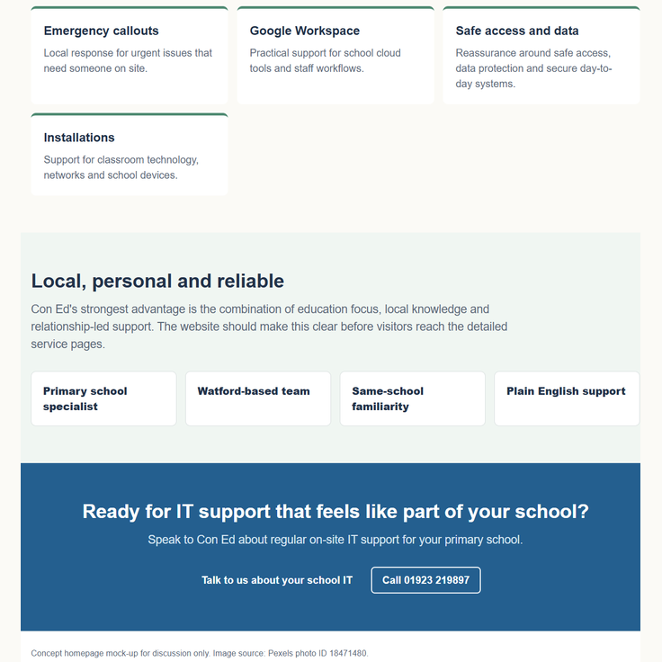

# School IT Support — Service Catalog & SLA Workflow Architecture

An operational framework and service delivery architecture designed to standardize school helpdesk workflows, structure incident management, and optimize support channels.

---

### ⚡ Operational Focus
* **The Problem:** Educational IT environments frequently suffer from vague, unstructured user support requests, poor incident categorization, and communications gaps between technicians and non-technical staff.
* **The Solution:** A structured ITIL-aligned Service Catalog and workflow matrix that maps clear escalation pathways, defines strict priority levels, and establishes readable Service Level Agreements (SLAs).

---

### 🛠️ Core Operational Implementations
* **Incident Workflow Mapping:** Standardized decision trees for common institutional IT scenarios (e.g., classroom AV failures, domain account lockouts, network drops) to accelerate Mean Time to Resolution (MTTR).
* **Service Level Agreements (SLAs):** Structured response, workaround, and resolution target timeframes calculated based on real-world operational impact and urgency.
* **Tiered Escalation Procedures:** Clearly defined boundaries between Tier-1 triage, Tier-2 systems administration, and vendor escalations to prevent resource bottlenecks.
* **Administrative Documentation:** Standard operating procedures (SOPs) and templates designed to streamline user communications during planned maintenance or critical infrastructure outages.

---

## 🎥 Visual Preview

### Hero Section Layout

### Services & Differentiators

### Trust & Call-To-Action Flow

---

## Recent Architectural Upgrades
* **Operational Restructuring:** Standardized repository file hierarchies by separating core automation logic, helper scripts, and test files.
* **Security Hardening:** Swapped legacy credential configs for environment variables and secure token validation policies.
* **Database Schema Upgrades:** Refactored primitive database types into native data structures for robust ORM and transaction handling.
* **Systems Maintenance:** Eradicated legacy diagnostic scripts, optimized loops, and established static analysis scanning to ensure code hygiene.
